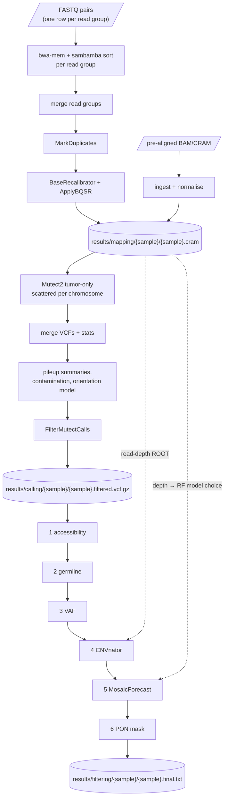

# Somatic / Mosaic SNV Calling Pipeline (BSMN refactor)

Tumor-only somatic and mosaic SNV calling for whole-genome sequencing, from raw
FASTQ to a filtered per-sample variant list. It is a Snakemake + Apptainer
reimplementation of the [BSMN pipeline](https://github.com/bsmn/bsmn-pipeline),
maintained by TJBaeLab.

```
FASTQ  ──mapping──▶  CRAM  ──calling──▶  VCF  ──filtering──▶  final.txt (chrom pos ref alt)
```

- **One command** (`run.py`) builds the sample sheet, sizes the run to the host,
  and runs any stage.
- **No conda**: every tool runs in a pinned Apptainer container.
- **Portable**: thread counts and Java heaps are derived from the host's cores and
  RAM when the run starts. The committed config carries no host- or cohort-specific
  values.
- Runs **locally** or on **SLURM**.

---

## Contents

1. [Quick start](#quick-start)
2. [How the pipeline works](#how-the-pipeline-works)
3. [Resources and performance](#resources-and-performance)
4. [Configuration](#configuration)
5. [Outputs](#outputs)
6. [Differences from the original BSMN](#differences-from-the-original-bsmn)
7. [Further documentation](#further-documentation)

---

## Quick start

### 1. Requirements

| | |
|---|---|
| Container runtime | **Apptainer** (or Singularity) on every compute node |
| Python | 3.9+ with `venv` on the submit host (no conda) |
| Tools for setup | `git`, `wget`, `lftp`, `samtools` |
| Disk | ~60 GB for `resources/hg38/`, plus a ~3 GB reference cache built on the first filtering run |
| Scheduler | optional: SLURM ([docs/SLURM_USAGE.md](docs/SLURM_USAGE.md)) |

### 2. Install (once per server)

```bash
git clone https://github.com/Jeonina/BSMN_pipeline_ij.git && cd BSMN_pipeline_ij
bash scripts/server_setup.sh
source .venv/bin/activate
```

`server_setup.sh` does the following:
- creates the Python venv and pulls the containers
- downloads and indexes the hg38 references (FASTA, dbSNP, Mills, 1000G,
  gnomAD, 1KG strict mask)
- assembles the panel-of-normals mask and clones the MosaicForecast models
- verifies every file

It ends with a `[5/5] Verifying resources` check. **Every line must show `✓`
before you continue.**

### 3. Describe your samples

Let `run.py` build `config/samples.tsv` from a FASTQ directory:

```bash
python run.py /data/fastq/ --dry-run                   # R1/R2 pairs found by file name
python run.py /data/cohort/ --sample-per-dir --dry-run # one sub-directory per sample
```

Or write it yourself. The schema is detected from the column names:

```
# FASTQ input: full mapping -> calling -> filtering
sample_id    readgroup    fq1                        fq2
S01          FC1.L1       /data/S01_L1_R1.fq.gz      /data/S01_L1_R2.fq.gz
S01          FC1.L2       /data/S01_L2_R1.fq.gz      /data/S01_L2_R2.fq.gz

# Pre-aligned input: BAM or CRAM, mapping is skipped
sample_id    bam
S02          /data/S02.cram
```

A sample with several read groups (lanes or flowcells) has one row per read
group. The read groups are merged after alignment.

> `run.py` **rewrites `config/samples.tsv` on every run** from the input you
> give it. To use a hand-written or pre-aligned sheet, drive Snakemake directly
> (below) with `--config samples=path/to/sheet.tsv`.

### 4. Run

```bash
python run.py /data/fastq/ --dry-run            # plan only: check the job list first
python run.py /data/fastq/ --stage all          # or --stage mapping | calling | filtering
```

Stages are cumulative and resumable:
- `--stage filtering` also runs any mapping or calling that is still missing.
- A re-run skips work that has already finished.

`run.py` passes Snakemake the memory budget and container binds it needs. If
you **drive Snakemake directly**, supply them yourself:

```bash
export APPTAINER_BIND=/data,/tmp     # every mount your FASTQs, results/ or resources/ live on
snakemake --snakefile workflow/Snakefile \
    --cores 32 --resources mem_mb=54000 \
    --config stage=filtering          # --config goes LAST: it swallows every argument after it
```

After a crash or kill, clear the lock and resume. `--unlock` also needs `--cores`:

```bash
snakemake --snakefile workflow/Snakefile --cores 1 --unlock --config stage=calling
snakemake --snakefile workflow/Snakefile --cores 32 --resources mem_mb=54000 \
    --rerun-incomplete --config stage=calling
```

### 5. Check the result

```bash
cat results/filtering/S01/S01.final.txt              # chrom  pos  ref  alt
python scripts/run_summary.py --sample S01           # per-filter funnel from the logs
```

---

## How the pipeline works



### Mapping: FASTQ → CRAM

1. Each read group is aligned with bwa-mem and coordinate-sorted.
2. The sample's read groups are merged and duplicate-marked.
3. Base qualities are recalibrated with GATK BQSR, using dbSNP, Mills and 1000G.
4. The result is written as a reference-compressed CRAM, with `flagstat.txt` for
   QC.

### Calling: CRAM → VCF

1. GATK4 Mutect2 runs in tumor-only mode, with gnomAD as the germline resource,
   scattered per chromosome.
2. The shards are merged.
3. Contamination is estimated and a read-orientation (strand/FFPE artefact)
   model is learned.
4. FilterMutectCalls applies both. PASS calls go on to filtering.

### Filtering: VCF → final list

Six filters run in sequence. Each one only removes candidates:

| # | Filter | Removes | Based on |
|---|---|---|---|
| 1 | accessibility | calls outside the 1000 Genomes strict mask (poorly mappable genome) | 1KG strict mask BED |
| 2 | germline | known common germline variants | gnomAD AF > 0.001 |
| 3 | VAF | calls consistent with a heterozygous germline VAF, or with too few supporting reads | binomial test p < 1e-6 vs. VAF 0.5; alt reads ≥ 5 |
| 4 | CNVnator | calls in amplified regions, where a low VAF is a copy-number or paralog artefact | CNVnator copy number ≥ 2.5 in a ±1 kb window |
| 5 | MosaicForecast | candidates the read-level random-forest model does not call mosaic | depth-matched trained RF model |
| 6 | PON mask | sites that recur in a panel of normals | IUPAC-encoded PON FASTA |

Here is the measured funnel for one ~110x brain WGS sample:

```
Mutect2 PASS 54,930 → accessible 20,372 → non-germline 19,973 → VAF 26 → CNV 19 → MosaicForecast/PON → final
```

Filters 1–3 remove almost all of the calls. Filters 4–6 then see only a few
dozen candidates per sample, and that is where true mosaic variants are
separated from artefacts.

**MosaicForecast model selection.** The trained models are depth-specific
(50x, 100x, 150x, 200x, 250x). A model whose depth does not match the data
changes every mosaic call, and nothing reports an error. With the default
`model: "auto"`:
- each sample's mean depth is measured with `samtools coverage` over chr20
- the model with the nearest depth label is used
- the choice is recorded in `results/filtering/{sample}/{sample}.mf_model.tsv`

**The mayo filter.** The original BSMN E-step offers mayo *or* MosaicForecast as
alternatives. This pipeline uses MosaicForecast. The `mayo_filter` rule is kept
but not wired in. To use it, point `mosaicforecast_filter`'s input at
`{sample}.mayo_filtered.txt`.

---

## Resources and performance

### How concurrency is decided

Snakemake runs as many jobs at once as both budgets allow:

```
concurrent jobs of a rule  =  min( --cores ÷ threads ,  --resources mem_mb ÷ mem_mb )
```

The `mem_mb` values are **reservations**, not measured use. Snakemake enforces
them only when it has a memory budget. With `--cores` alone, every declaration
is ignored and RAM is overcommitted: 32 cores would start 32 × 8.5 GB BQSR jobs.
`run.py` sets the budget to 85% of host RAM, and `--mem-mb` overrides it. On
most hosts, **memory, not cores, limits concurrency**.

### Measured cost per stage

Measured on a ~100x brain WGS cohort (VM with 180 cores and 98 GB RAM, results
on NFS). Use these as reference points, not guarantees.

| Stage / step | Unit | Wall time | Peak RSS | Reserved | Notes |
|---|---|---|---|---|---|
| bwa-mem + sort | per read group | ~12 h | — | 16 GB | CPU-bound; threads auto-tuned (8) |
| Mutect2 | per chromosome shard | ~3.2 h | 2.4–2.8 GB | `bqsr_memory_gb` + 1 GB | effectively single-threaded; 24 shards per sample |
| accessibility + germline | per sample | < 1 min | small | 8 GB | |
| VAF filter | per sample | ~2.2 h | small | 8 GB | one mpileup per candidate (~20k) |
| `cnvnator_root` | per sample | ~2–3 h | **12.9 GB** | 16 GB | peak set by the hg38 bin-100 histogram, not by coverage |
| MosaicForecast | per sample | seconds–minutes | ~1 GB | 8 GB | ~1 s per candidate |
| PON mask | per sample | < 1 min | small | 8 GB | |

Filtering costs about **4–5 job-hours per sample**, almost all of it in the VAF
filter and `cnvnator_root`. The two do not depend on each other and run
concurrently, so a sample's wall time is closer to **2–3 hours**. Throughput
comes from running many samples at once.
The per-rule thread counts (`filtering.threads`) are therefore fixed at what each
tool can actually use, not set as a fraction of the host.

### Tuning for your host

- **Memory reservations.** Every filtering rule writes
  `benchmarks/filtering/{sample}/{rule}.tsv`.
  - After the first samples, set `filtering.mem_gb` a little above the observed
    `max_rss`. Do not set `cnvnator_root` below ~14 GB.
  - For calling, the Mutect2 reservation is the usual bottleneck. It comes from
    `bqsr_memory_gb` in `config/resolved_params.yaml`.
- **Scratch.** `cnvnator_root` decodes each CRAM to a temporary BAM of **250–300
  GB per sample** at ~100x.
  - Point `scratch_dir` at fast local storage with room for one BAM per
    concurrent sample.
  - The BAM is deleted on any exit. If `scratch_dir` is unset, scratch goes to
    `results/scratch/`.
- **Two runs on one host.** Two Snakemake processes (e.g. calling and filtering
  in separate clones) do not see each other's reservations. Give each a
  `--resources mem_mb` so that together they fit in physical RAM, and leave
  headroom for anything else running on the machine.
- **Auto-tuning.** `config/resolved_params.yaml` holds the host-derived values.
  `run.py` regenerates it on every run. If you drive Snakemake directly, it is
  generated only when absent, so delete it after moving to a different host.

---

## Configuration

Everything is in `config/config.yaml`. Most keys can be left alone. These are
the ones you will actually change:

| Key | What it controls |
|---|---|
| `samples` | sample sheet path (`--config samples=...` to switch per run) |
| `stage` | `mapping` / `calling` / `filtering` / `all` (usually set by `run.py --stage`) |
| `scratch_dir` | where transient scratch goes (see above) |
| `ref`, `known_sites` | reference FASTA and BQSR known sites (set up by `server_setup.sh`) |
| `calling.chromosomes` | chromosomes to call (and to scatter over) |
| `calling.pon` | optional Mutect2 panel of normals |
| `filtering.vaf` | binomial p threshold, minimum alt reads, MAPQ/BQ cut-offs |
| `filtering.cnvnator` | bin size, copy-number threshold, window |
| `filtering.mosaicforecast.model` | `"auto"` (per sample, by depth) or a model path to pin |
| `filtering.mosaicforecast.min_prob` | `0` = all mosaic calls; `0.6` = high-confidence set |
| `filtering.threads`, `filtering.mem_gb` | per-rule thread counts and memory reservations |

Mapping and calling thread counts default to `auto`, which derives them from the
host. Set a number to pin one.

---

## Outputs

```
results/
  mapping/{sample}/{sample}.cram(.crai)       analysis-ready alignment
  mapping/{sample}/flagstat.txt               mapping QC
  calling/{sample}/{sample}.filtered.vcf.gz   Mutect2 + FilterMutectCalls
  filtering/{sample}/{sample}.final.txt       final somatic/mosaic SNVs (chrom pos ref alt)
  filtering/{sample}/{sample}.mf_model.tsv    measured depth + MosaicForecast model used
logs/{stage}/{sample}/{rule}.log              per-rule logs
benchmarks/filtering/{sample}/{rule}.tsv      wall time and max_rss per rule
```

The intermediate filter lists are temporary: each is removed once the next
filter has consumed it. `scripts/run_summary.py` rebuilds the funnel from the
logs.

---

## Differences from the original BSMN

This is a reimplementation. It does not match the original at the tool or
scheduler level:

| | Original BSMN | This pipeline |
|---|---|---|
| Orchestration | shell jobs + SGE | **Snakemake** (local or SLURM) |
| Software | conda (`bp` / `bp_frozen`) | **Apptainer containers**, pinned in `config/containers.yaml` |
| Caller | GATK HaplotypeCaller (multi-ploidy) | **GATK4 Mutect2** (tumor-only) |
| E-step | mayo *or* MosaicForecast | MosaicForecast (mayo kept, unwired) |
| MosaicForecast model | one fixed model | **chosen per sample** from measured depth |

The legacy shell pipeline is kept under `jobs/` for reference only.

---

## Further documentation

- [PIPELINE.md](PIPELINE.md): architecture and design notes
- [docs/PRODUCTION_RUN.md](docs/PRODUCTION_RUN.md): full cohort runbook (pilot first, then scale)
- [docs/PRODUCTION_VALIDATION.md](docs/PRODUCTION_VALIDATION.md): runtime checks to confirm on real data before the first full run
- [docs/SLURM_USAGE.md](docs/SLURM_USAGE.md): running on SLURM (partitions, accounts, monitoring)
- Validation configs: `config/config.validation.yaml` (chr22), and
  `config/config.chr20.yaml` + `config/samples.bam.example.tsv` (HG002 chr20 from
  a pre-aligned CRAM)

## Contributing

Branch from `main` with a descriptive name, open a pull request, and run
`pytest` before requesting review.
